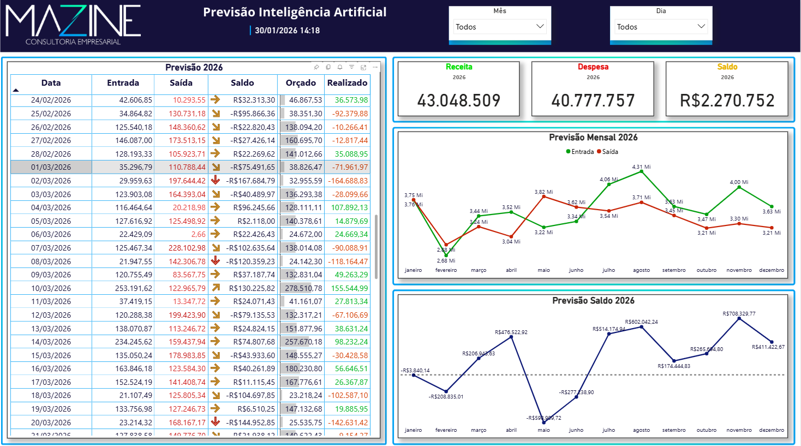

# Daily Financial Forecasting with XGBoost — Mazine IA & DATA

A production-ready system for **daily revenue and expense forecasting per business unit**, with a 60-day ahead horizon. Built by **Mazine IA & DATA** using XGBoost with time series cross-validation, iterative forecasting, and full calendar feature engineering.

> This portfolio repository uses **100% synthetic data** — no real client data or internal credentials are present.

---

## Production Result

This project was developed, validated, and is currently running in a live production environment. The dashboard below is from the real deployment — financial figures belong to the client and are kept confidential, which is why this repository uses synthetic data that replicates the same statistical and seasonal patterns.



> The XGBoost model generates daily revenue and expense forecasts for the next 60 days, consolidated in Power BI with a side-by-side comparison of **Budgeted**, **Actual**, and **AI Forecast**.

---

## Project Structure

```
previsao_financeira/
├── main.py                          # Main pipeline
├── generate_sample_data.py          # Synthetic data generator
├── eda.ipynb                        # Exploratory Data Analysis notebook
├── requirements.txt
├── .env.example                     # Environment variable template
├── dados/
│   ├── base_diaria.csv              # Generated by generate_sample_data.py
│   ├── base_diaria_unidades.csv     # Generated by generate_sample_data.py
│   └── feriados_locais.csv          # Local holidays (editable)
├── extracao/
│   ├── db_connect.py                # Database connection via env vars
│   ├── gerar_base_diaria.py         # Calendar feature engineering
│   └── loaders.py                   # CSV and holiday loaders
├── treinadores/
│   └── treinar_xgboost.py           # Training with TimeSeriesSplit
├── previsoes/
│   ├── prever_xgboost.py            # Iterative 60-day forecasting
│   ├── previsao_unificada.py        # Per-unit consolidation
│   └── salvar_previsao_db.py        # Database export
└── modelos/                         # Trained .pkl files (git-ignored)
```

---

## Installation

```bash
git clone https://github.com/seu-usuario/previsao-financeira-xgboost.git
cd previsao-financeira-xgboost
pip install -r requirements.txt
```

---

## Configuration

### 1. Environment variables (only needed for database export)

```bash
cp .env.example .env
```

Edit `.env` with your credentials:

```env
DB_HOST=your_host
DB_PORT=5432
DB_NAME=your_database
DB_USER=your_user
DB_PASS=your_password
```

The `.env` file is listed in `.gitignore` and **must never be committed**.

### 2. Local holidays (optional)

Edit `dados/feriados_locais.csv` to add municipal holidays:

```csv
data,cidade,descricao
09-16,,City Anniversary
06-13,,Local Patron Saint
```

Accepted formats for the `data` column: `MM-DD` (repeats every year) or `YYYY-MM-DD` (fixed date).

---

## How to Run

### Step 1 — Generate synthetic data

```bash
python generate_sample_data.py
```

Creates `dados/base_diaria_unidades.csv` and `dados/base_diaria.csv` with simulated history for 10 business units from 2023 to today.

### Step 2 — Run the full pipeline

```bash
python main.py
```

The pipeline will:
1. Load the historical base
2. Train XGBoost models for revenue and expense per unit
3. Generate an iterative 60-day forecast
4. Print a formatted table in the terminal
5. Save results to `previsoes/historico_previsoes.csv`
6. *(Optional)* Send to database — set `ENVIAR_DB = True` in `main.py`

### Step 3 — Explore the EDA notebook

```bash
jupyter notebook eda.ipynb
```

---

## Model Architecture

| Component | Detail |
|---|---|
| Algorithm | XGBoost (`reg:squarederror`) |
| Validation | `TimeSeriesSplit` — 4 splits, 30-day test window |
| Hyperparameter selection | Up to 6 candidates, chosen by lowest mean MAE |
| Early stopping | 50 rounds without improvement |
| Outlier handling | Quantile clipping (0.5% / 99.5%) |
| Target lags | 1, 7, 14, 30, 365 days |
| Rolling means | 7, 30 days |
| Growth features | 7 and 30-day windows |
| National holidays | Computed via Butcher's Easter algorithm |
| Local holidays | Configurable via CSV |
| Forecast horizon | 60 days (iterative — each predicted day feeds the next) |

---

## EDA Highlights

The `eda.ipynb` notebook covers:
- Full time series visualization with monthly aggregations
- Revenue and expense breakdown per business unit
- Day-of-week and month seasonality analysis
- Outlier detection and distribution analysis
- Trend decomposition (moving average)
- **Backtesting: Predicted vs Actual** with MAE and MAPE metrics

---

## Dependencies

```
pandas >= 2.0
xgboost >= 2.0
scikit-learn >= 1.3
sqlalchemy >= 2.0
psycopg2-binary >= 2.9
python-dotenv >= 1.0
```

---

## Security

- No credentials are hardcoded anywhere in the codebase
- Database connection uses **environment variables exclusively**
- `.env`, `modelos/*.pkl`, and `dados/*.csv` (except holidays) are git-ignored

---

*Developed by [Mazine IA & DATA](https://github.com/seu-usuario)*
